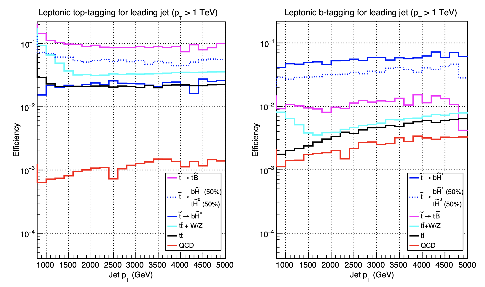

# DD-Gaia-substructure

Project: <a href="https://journals.aps.org/prd/abstract/10.1103/PhysRevD.96.036017">Jet Observables and Stops at 100 TeV Collider</a>

Author: <a href="http://inspirehep.net/author/profile/Shing.Chau.Leung.1">John Leung</a>

arXiv: <a href="https://arxiv.org/abs/1704.03014">1704.03014</a>

Date: 2017

## Feature:

By using jet substructure variables, we study the sensitivity of a 100 TeV proton-proton collider to pair production of stops that decay to tops or bottoms and higgsinos. In a 100 TeV collider, super-boosted tops or bottoms with transverse momentum of order TeV will be produced abundantly. Therefore, it calls for new strategies to identify them. We will apply a set of simple jet observables, including track-based jet mass, N-subjettiness and mass-drop, to tag the boosted hadronic or leptonic decaying objects and suppress the Standard Model as well as possible SUSY backgrounds.

**The work is done in collaboration with with JiJi Fan, Prerit Jaiswal, and John Shing Chau Leung.**

