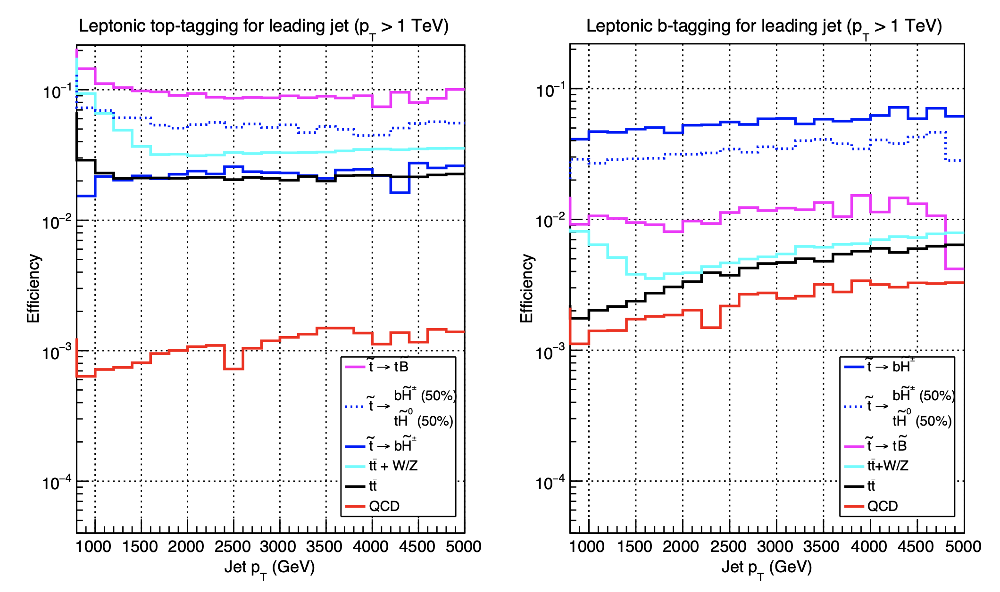
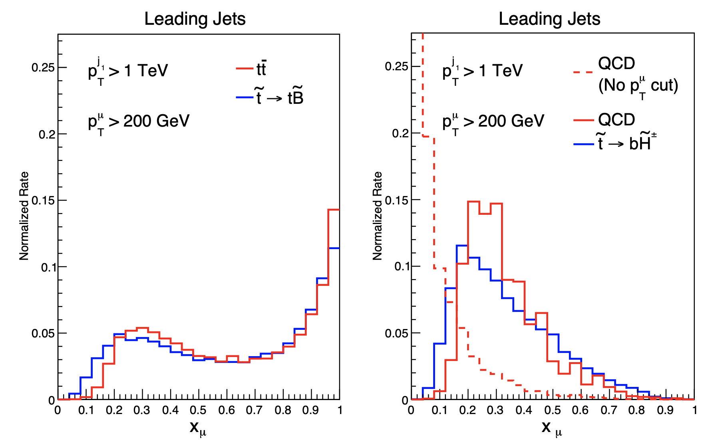
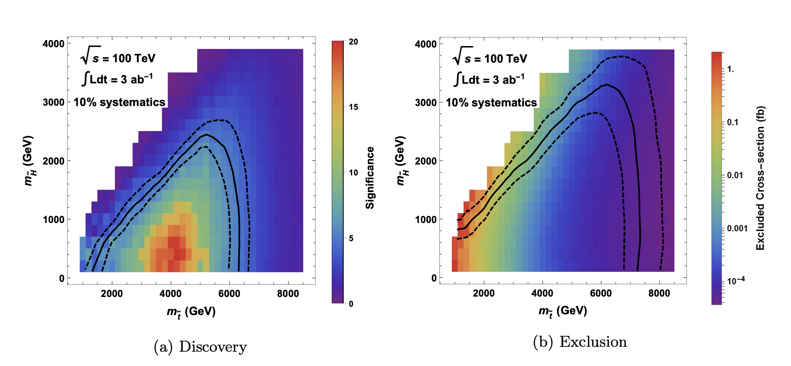

# Jet Substructures in a 100 TeV Collider

Project: <a href="https://journals.aps.org/prd/abstract/10.1103/PhysRevD.96.036017">Jet Observables and Stops at 100 TeV Collider</a>

Author: <a href="http://inspirehep.net/author/profile/Shing.Chau.Leung.1">John Leung</a>

arXiv: <a href="https://arxiv.org/abs/1704.03014">1704.03014</a>

Date: 2017

## Feature:

By using jet substructure variables, we study the sensitivity of a 100 TeV proton-proton collider to pair production of supersymmetric tops (stops) that decay to tops and bottoms/higgsinos. In a 100 TeV collider, super-boosted tops or bottoms with transverse momentum of order TeV will be produced abundantly. Therefore, it calls for new strategies to identify them. We will apply a set of simple jet observables, including track-based jet mass, N-subjettiness and mass-drop, to tag the boosted hadronic or leptonic decaying objects and suppress the Standard Model as well as possible SUSY backgrounds.

**The work is done in collaboration with with JiJi Fan, Prerit Jaiswal, and John Shing Chau Leung.**

There are different possibilities for stop quark to decay depending on the supersymmetry (SUSY) model,

st → t + MET  (100% stop-bino, 50% stop-higgsino),

st → b + MET  (50% stop-higgsino).

We will demonstrate two of the cuts. The first one we demonstrate is the leading jet pT cut. From the plot below, we can see that stops typically give a large leading jet pT. This is one of the most powerful tools to separate a SUSY signal from Standard Model (SM) background.

Another one of such variable that behaves like this is the missing tranverse energy (MET). 

To distinguish between different SUSY models, we have to identify the 50% chance of boosted b-quarks produced from stop decays in stop-higgsino model (which does not happen in stop-bino model). Here we can use the massdrop variable, which is 1 minus the square of jet mass without muon divided by square of jet mass with muon included. As we can see in the following plot, the stop decaying to top, and that to bottom give very different massdrop spectrum.

In the same plot, we also show the dominant SM background that gives the similar massdrops. We can see that ttbar contributes similar massdrop spectrum to stop to top, and QCD background is similar in massdrop to stop to bottom. This is because ttbar are boosted in a 100 TeV collider and are sources of boosted tops, and similarly for boosted bottoms coming from energetic QCD jets. These SM backgrounds have to be filtered by other cuts.

The final result is shown above. Assuming 10% systematic uncertainties, the future 100 TeV collider can discover (exclude) stops with masses up to 6 (7) TeV with 3  inverse attobarn of integrated luminosity if the stops decay to binos/higgsinos. At stops with mass ≤ 6 TeV, we can also determine whether the lightest supersymmetry particle (LSP) is a higgsino or bino.
